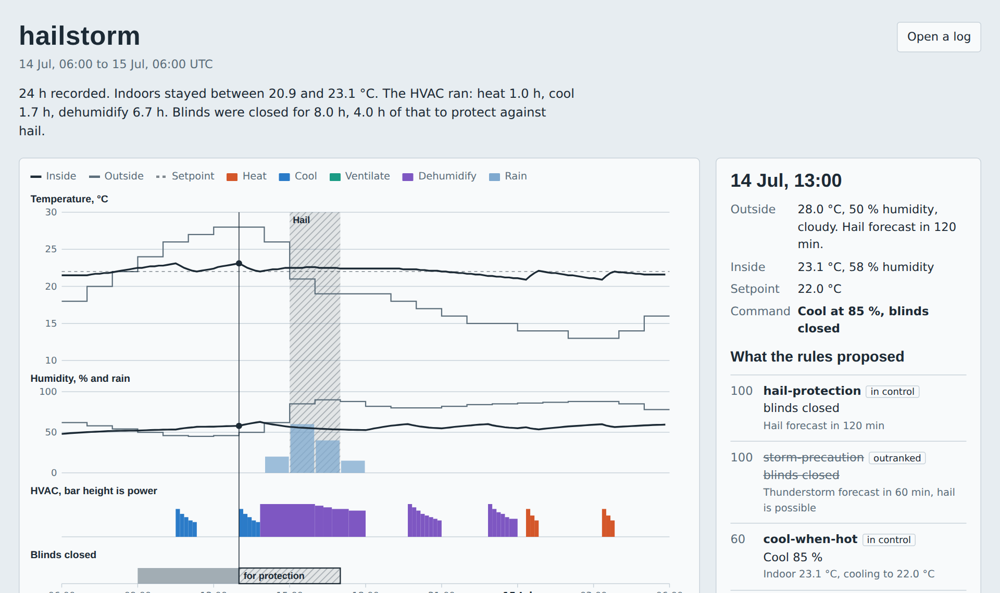
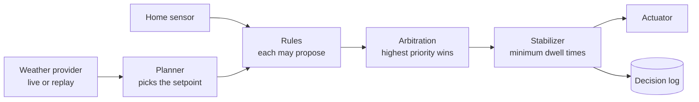

# hvac-brain

The decision engine for a smart home HVAC and blinds. It reads the current weather and the forecast for a location, decides what the heating, cooling, ventilation, dehumidifier and blinds should be doing, and writes down why.

There are no motors or thermostats here, because those differ for every installation. This project is the "brain", plus a simulator that replays weather scenarios against a simple model of a house to show that the brain behaves sensibly, including when the forecast is wrong.



## Quick start

Requires Node.js 20 or newer.

```bash
npm install
npm test                                         # 59 tests, including every scenario
npm run simulate -- scenarios/hailstorm.json     # replay a scripted day, writes logs/hailstorm.jsonl
npm run dashboard -- logs/hailstorm.jsonl        # turn that log into logs/hailstorm.html
npm run analyze -- logs/hailstorm.jsonl          # weather patterns found in one or more logs
npm run live                                     # one decision from real weather
npm run live -- --watch                          # keep deciding every 10 minutes
```

## How a decision is made



1. **Planner.** Normally the setpoint is the configured target (22 °C). If a heat wave is forecast within 6 hours but has not arrived, the setpoint drops by 0.5 °C so the house goes into it pre-cooled. Ahead of a cold snap it rises instead.
2. **Rules.** Each rule looks at the weather, forecast, house state and previous command, and may propose something for the HVAC, the blinds, or both.
3. **Arbitration.** The highest-priority proposal wins, separately for HVAC and blinds.
4. **Stabilizer.** A mode change within 20 minutes of the previous one (30 for blinds) is postponed, so the system cannot flip back and forth. Safety rules skip the wait.

| Rule | Priority | What it does |
| --- | --- | --- |
| `hail-protection` | 100 (safety) | Closes the blinds 2 hours before forecast hail and during it |
| `storm-precaution` | 100 (safety) | Closes the blinds 1 hour before and during any thunderstorm, because forecasts often miss hail |
| `free-cooling` | 65 | Ventilates instead of running the compressor when outdoor air is cooler and dry enough |
| `heat-when-cold` | 60 | Heats below setpoint − 1 °C until the setpoint is reached |
| `cool-when-hot` | 60 | Cools above setpoint + 1 °C until the setpoint is reached |
| `dehumidify-when-damp` | 50 | Dehumidifies above 60 % humidity, or above 55 % while it rains or is about to |
| `solar-shading` | 30 | Closes the blinds against strong sun on hot days |

The rules use hysteresis: they start at one threshold and stop at another, so a temperature hovering around a threshold does not cause switching. All thresholds live in `src/config.ts` and can be overridden under `"comfort"` in `config.json`.

## Scenarios

| File | Situation | What the tests assert |
| --- | --- | --- |
| `hailstorm.json` | Hot morning, thunderstorm with hail in the afternoon | Blinds closed by the hail rule from 2 h before until the hail ends, then reopened |
| `heatwave.json` | Mild night, then 35 °C | Pre-cools with outdoor air before sunrise, never heats, stays in the comfort band, blinds closed in strong sun |
| `rainy-day.json` | Nine hours of warm rain | Dehumidifies through the rain and keeps humidity at or below 60 % |
| `cold-snap.json` | Drop to −17 °C overnight | Raises the setpoint before the cold arrives, never cools |
| `hail-false-alarm.json` | Forecast promises hail, then withdraws it | Blinds close for the forecast and reopen as soon as it is corrected, one hour later |
| `hail-surprise.json` | Hail falls that was never forecast | Blinds are already closed 2 h before the hail because of the storm precaution; without that rule there is no warning at all |

Every scenario is also checked for stability: no mode change sooner than the dwell time, and no direct switch between heating and cooling.

In the heat wave, planning ahead means the simulated house enters the hot hours about 0.7 °C cooler and needs about 9 % less cooling effort while it is above 30 °C outside. Total effort over the day is nearly unchanged; the work moves to the cooler hours.

### Writing a scenario

Copy one of the files. A scenario is a start time, the initial indoor state, and one weather entry per hour in `hours`, which is what actually happens. `weatherCode` is the WMO code (see `src/weather/codes.ts`).

To make the forecast wrong, add `forecastErrors`. Each entry says what the forecast showed for certain hours, and until when:

```json
"forecastErrors": [
  { "untilHour": 8, "hours": { "9": { "weatherCode": 99 }, "10": { "weatherCode": 96 } } }
]
```

Here, until 8 hours after the start, the forecast shows hail in hours 9 and 10. From hour 8 on, the forecast matches `hours` again. Current conditions always come from `hours`.

## Decision log

Every decision is appended as one JSON line to `logs/` with the weather, the forecast outlook, the setpoint, the house state, every proposal that was made, the final command, the rule responsible, and any note from the stabilizer. This answers "why were the blinds closed at 13:00?" after the fact.

## Dashboard

`npm run dashboard -- logs/hailstorm.jsonl` writes a single HTML file with the log embedded, so it opens straight from disk and can be shared as is. It shows temperature, humidity, rain, HVAC mode and blinds on one time axis. Pointing at any moment shows what every rule proposed, which proposals won and why. `dashboard/template.html` opened on its own accepts a log by drag and drop.

## Weather patterns

`npm run analyze -- logs/*.jsonl` reads any number of logs and reports:

- spells of rain, thunderstorm, hail, heat and frost, with their length and extremes
- what the three hours before each start of rain looked like (humidity, gusts, temperature)
- the daily temperature cycle, once every hour of the day has been seen
- each time the blinds were closed for protection, how long before the hail that was, and whether hail came at all
- how long each rule was in control of the HVAC

The report says so when there are too few events to call something a pattern. It becomes useful after `npm run live -- --watch` has been running for a few weeks.

## Live mode and real hardware

`npm run live` fetches the hourly forecast for the location in `config.json` from [Open-Meteo](https://open-meteo.com), which is free for non-commercial use and needs no API key.

The control loop in `src/controller.ts` only knows two interfaces from `src/home/ports.ts`:

```ts
interface HomeSensor { read(): Promise<HomeState> }
interface Actuator   { apply(command: Command): Promise<void> }
```

Until real hardware exists, `SimulatedHome` implements both. Connecting a real installation means writing these two adapters (for example against Home Assistant or MQTT) and passing them to the loop in `src/cli.ts`.

## Project layout

```
src/weather/    WeatherProvider interface, Open-Meteo (live) and scenario replay
src/brain/      planner (setpoint), rules, and the Brain (arbitration + stabilizer)
src/home/       sensor and actuator interfaces
src/sim/        house model, simulated home and the simulation loop
src/analysis/   weather patterns from decision logs
src/dashboard/  builds the HTML dashboard from a log
src/controller.ts  one pass of the control loop
dashboard/      the dashboard page itself
scenarios/      scripted weather
tests/          unit tests and scenario tests
```

## Limits

- The house model is a simple approximation that is not calibrated against a real building. It exists so decisions have consequences in simulation; the numbers it produces are illustrative.
- Forecast errors are scripted by hand per scenario. The brain reacts to them through fixed safety margins; it does not estimate how reliable a forecast is.
- There are no adapters for real sensors or actuators yet, only the interfaces.

## Roadmap

- Measure forecast accuracy from live logs by comparing what was forecast with what happened
- Adapters for real hardware (Home Assistant, MQTT)
- Cost-aware planning using electricity prices
- Wind protection for external blinds

## Credits

Weather data by [Open-Meteo.com](https://open-meteo.com). Licensed under MIT.
